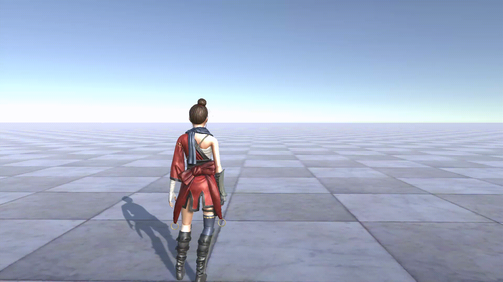

# ?? Unity Third-Person Game Demo

This project demonstrates how to create a simple **third-person game** using the Unity engine.  
It covers the following key features:

- Loading and setting up a **3D character model**  
- Applying an **idle animation**  
- Implementing a **walking animation** for smooth character movement  
- A **camera system** that follows the player character  

---

## ?? Preview

### Idle Animation

### Walking Animation

